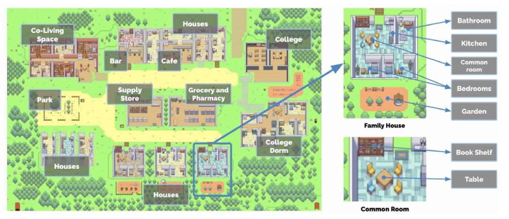
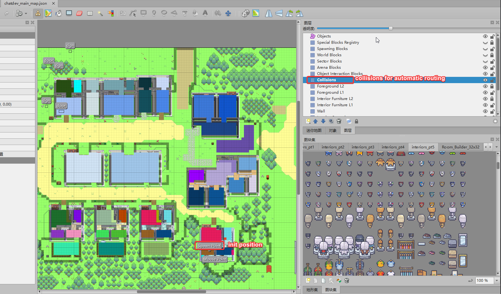

# Generative Agents Dev: Interactive Simulacra of Human Behavior With Player

## Social Simulation
This is a simulated AI town social environment, consisting of 25 NPCs with independent consciousness and a controlled player, the map size is 180x100, and the size of a single grid is defined as 32. 25 NPCs have predefined daily life trajectories. You can get close to the NPC for chat input by customizing the NPC's prompt description, or you can customize your prompt description for the marked location and chat with yourself when you walk to the marked location.
When the distance between the player and the NPC <100, the NPC will trigger the active greeting according to the predefined role description. When the distance between the player and the NPC >200, the chat area will be automatically ended.

## Customize your own map

Drag `src/assets/maps/generative_agents_main.json` to TILED app.

## Build from Source Code

* Clone the source code.
* Run `yarn install` to install dependencies.
* Run `yarn build` to build the dist.
* Run `yarn run serve-dev` to run the local server.
